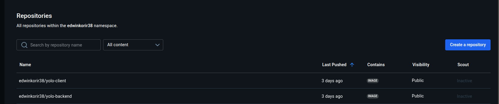

 README.md
#  YOLO (E-Commerce Microservice-Dockerized)

This project is a **containerized microservice e-commerce platform** built using **Node.js**, **React**, and **MongoDB**.  
It allows users to add and view retail products in a dashboard-like interface.

The project demonstrates Docker containerization concepts — creating lightweight, isolated services for the backend, frontend, and database — orchestrated using **Docker Compose**.


##  **Project Overview**

| Component  | Tech Stack | Description |
|-------------|-------------|-------------|
| **Frontend** | React + Nginx | Serves the e-commerce user interface |
| **Backend** | Node.js + Express | Handles API requests, CRUD operations, connects to MongoDB |
| **Database** | MongoDB | Stores product data persistently |


## **Repository Structure**


YOLO/
│
├── backend/ # Node.js backend API
│ ├── Dockerfile
│ ├── package.json
│ ├── server.js
│ ├── routes/
│ └── models/
│
├── client/ # React frontend
│ ├── Dockerfile
│ ├── package.json
│ ├── src/
│ └── public/
│
├── docker-compose.yml # Orchestrates all 3 services
├── explanation.md # Implementation reasoning
├── README.md # Documentation file
└── .gitignore


##  **Microservice Architecture**

Each component runs in its own container:

| Service | Port | Container Name | Image |
|----------|------|----------------|--------|
| Frontend | `3000 → 80` | `yolo-client` | `edwinkorir38/yolo-client:v1.0.1` |
| Backend | `5000 → 5000` | `yolo-backend` | `edwinkorir38/yolo-backend:v1.0.0` |
| MongoDB | `27017 → 27017` | `yolo-mongo` | `mongo:6` |

All services communicate through a **custom bridge network (`app-net`)**, defined in `docker-compose.yml`.


### YOLO - Full-Stack Containerized App (Frontend + Backend + MongoDB)

A full-stack Node.js, React, and MongoDB application fully containerized using **Docker** and managed with **Docker Compose**.

---

##  Docker Setup

### 1.  Clone the repository

   ```
   bash
     
     git clone https://github.com/Edwinkorir38/yolo.git
    
     cd yolo
  ````

## 2. **Build and run containers**

```
bash

docker-compose up --build

```

###  3. **Acess the app**

| Service        | URL                                                                      |
| -------------- | ------------------------------------------------------------------------ |
|  Frontend   | [http://localhost:3000](http://localhost:3000)                           |
|  Backend API | [http://localhost:5000/api/products](http://localhost:5000/api/products) |
|  MongoDB    | `mongodb://yolo-mongo:27017/yoloDB` (internal access)                    |


## **4️ Stop containers**
````

bash

docker-compose down

````


The MongoDB data will persist thanks to the app-mongo-data volume.
 
 | Variable            | Location         | Description                  |
| ------------------- | ---------------- | ---------------------------- |
| `MONGO_URI`         | Backend service  | Connection string to MongoDB |
| `REACT_APP_API_URL` | Frontend service | Backend API endpoint         |


These are defined directly inside ```docker-compose.yml```.

 ## **Docker Images and Versioning**

All custom images are versioned and hosted on DockerHub:
| Service  | Version  | Repository                                                                                      |
| -------- | -------- | ----------------------------------------------------------------------------------------------- |
| Backend  | `v1.0.0` | [edwinkorir38/yolo-backend](https://hub.docker.com/repository/docker/edwinkorir38/yolo-backend) |
| Frontend | `v1.0.1` | [edwinkorir38/yolo-client](https://hub.docker.com/repository/docker/edwinkorir38/yolo-client)   |

Versioning follows semantic versioning (semver) conventions for easy tracking.

 ### **Development Commands**

| Task                              | Command                              |
| --------------------------------- | ------------------------------------ |
| Build only backend                | `docker-compose build yolo-backend`  |
| Restart specific service          | `docker-compose restart yolo-client` |
| View container logs               | `docker logs yolo-backend`           |
| Remove all containers and volumes | `docker-compose down -v`             |

### **Git Workflow Summary**

| Step  | Description                                                    |
| ----- | -------------------------------------------------------------- |
| **1** | Initialized Git repo and added `.gitignore` for `node_modules` |
| **2** | Created Dockerfiles for backend and frontend                   |
| **3** | Configured `docker-compose.yml`                                |
| **4** | Tested containers locally                                      |
| **5** | Tagged and pushed images to DockerHub                          |
| **6** | Wrote documentation (`README.md`, `explanation.md`)            |
| **7** | Final push to GitHub with descriptive commits                  |


### **Persistence:**

MongoDB data is stored in a named Docker volume app-mongo-data, ensuring it survives container restarts.

## **Networking:**

A custom bridge network app-net enables inter-container communication:

* Backend connects to MongoDB through mongodb ```https://yolo-mongo:27017/yoloDB```

* Frontend connects to backend via ```https://yolo-backend:5000/api```

## **Debugging Notes**

| Issue                      | Resolution                                                         |
| -------------------------- | ------------------------------------------------------------------ |
| MongoDB connection refused | Verified container names and used correct internal network address |
| Backend failed to start    | Added `depends_on` in `docker-compose.yml`                         |
| React not loading          | Updated `REACT_APP_API_URL` environment variable                   |


### **Best Practices Applied**

* Best Practices Applied

* Multi-stage builds for smaller image sizes

* Versioned Docker images (SemVer)

* Persistent MongoDB volume

* Bridge network for isolated communication

* .dockerignore for smaller build contexts

* Clean folder and Git structure

* Descriptive commit messages

 ### **DockerHub Screenshot**


 ### **Author**

**Name:** Edwin Korir

**GitHub:** https://github.com/Edwinkorir38

**DockerHub:** https://hub.docker.com/u/edwinkorir38

 ### **License**

This project is for educational purposes - containerization and microservice architecture demonstration.