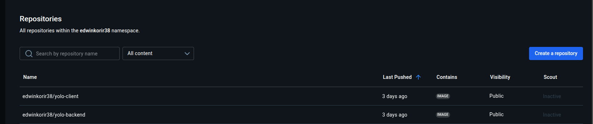
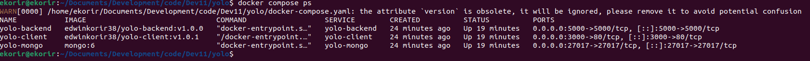
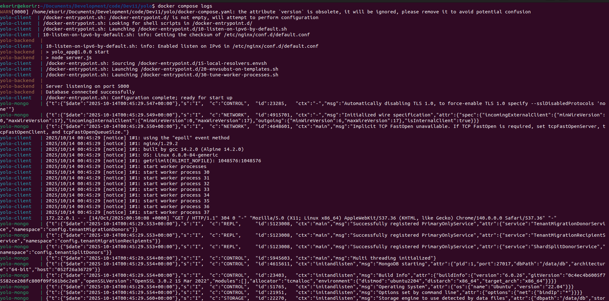
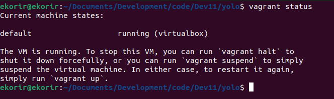
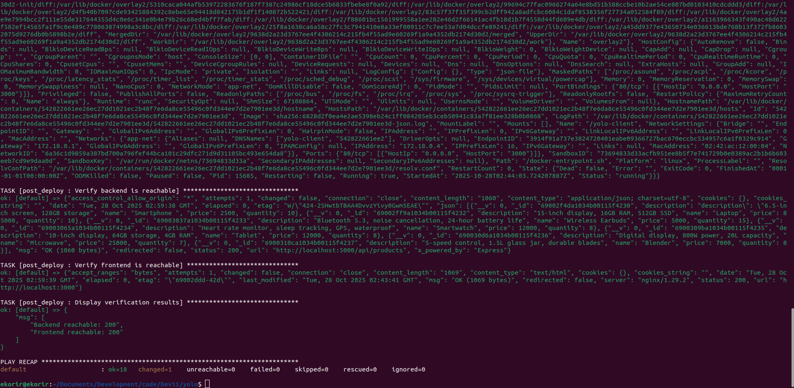
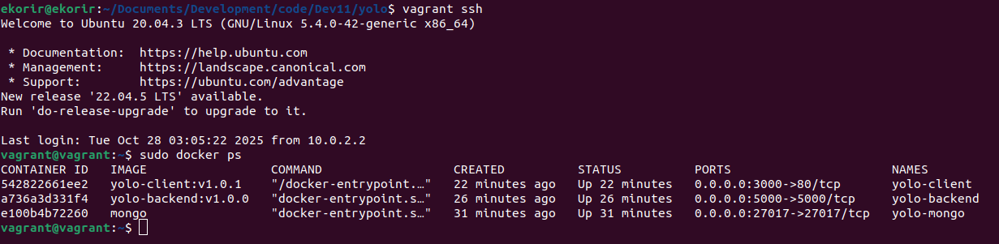
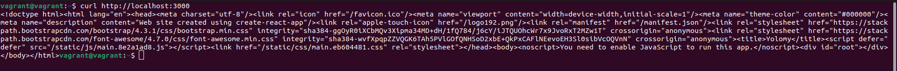
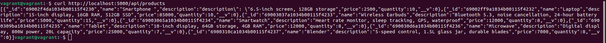
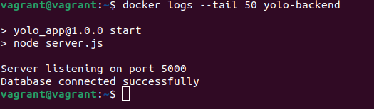

 README.md
#  YOLO (E-Commerce Microservice-Dockerized)


This project is a **containerized microservice e-commerce platform** built using **Node.js**, **React**, and **MongoDB**.  
It allows users to add and view retail products in a dashboard-like interface.

The project demonstrates Docker containerization concepts,  creating lightweight, isolated services for the backend, frontend, and database orchestrated using **Docker Compose**.


##  **Project Overview**

| Component  | Tech Stack | Description |
|-------------|-------------|-------------|
| **Frontend** | React + Nginx | Serves the e-commerce user interface |
| **Backend** | Node.js + Express | Handles API requests, CRUD operations, connects to MongoDB |
| **Database** | MongoDB | Stores product data persistently |


##  **Microservice Architecture**

Each component runs in its own container:

| Service | Port | Container Name | Image |
|----------|------|----------------|--------|
| Frontend | `3000 → 80` | `yolo-client` | `edwinkorir38/yolo-client:v1.0.1` |
| Backend | `5000 → 5000` | `yolo-backend` | `edwinkorir38/yolo-backend:v1.0.0` |
| MongoDB | `27017 → 27017` | `yolo-mongo` | `mongo:6` |

All services communicate through a **custom bridge network (`app-net`)**, defined in `docker-compose.yml`.


### YOLO - Full-Stack Containerized App (Frontend + Backend + MongoDB)

A full-stack Node.js, React, and MongoDB application fully containerized using **Docker** and managed with **Docker Compose**.

---

##  Docker Setup

### 1.  Clone the repository

   ```
   bash
     
     git clone https://github.com/Edwinkorir38/yolo.git
    
     cd yolo
  ````

## 2. **Build and run containers**

```
bash

docker-compose up --build

```

###  3. **Acess the app**

| Service        | URL                                                                      |
| -------------- | ------------------------------------------------------------------------ |
|  Frontend   | ```[http://localhost:3000] ```                          |
|  Backend API | ```[http://localhost:5000/api/products]```
|  MongoDB    | `mongodb://yolo-mongo:27017/yoloDB` (internal access)                    |


## **4️ Stop containers**
````

bash

docker-compose down

````


The MongoDB data will persist thanks to the app-mongo-data volume.
 
 | Variable            | Location         | Description                  |
| ------------------- | ---------------- | ---------------------------- |
| `MONGO_URI`         | Backend service  | Connection string to MongoDB |
| `REACT_APP_API_URL` | Frontend service | Backend API endpoint         |


These are defined directly inside ```docker-compose.yml```.

 ## **Docker Images and Versioning**

All custom images are versioned and hosted on DockerHub:
| Service  | Version  | Repository                                                                                      |
| -------- | -------- | ----------------------------------------------------------------------------------------------- |
| Backend  | `v1.0.0` | [edwinkorir38/yolo-backend](https://hub.docker.com/repository/docker/edwinkorir38/yolo-backend) |
| Frontend | `v1.0.1` | [edwinkorir38/yolo-client](https://hub.docker.com/repository/docker/edwinkorir38/yolo-client)   |

Versioning follows semantic versioning (semver) conventions for easy tracking.

 ### **Development Commands**

| Task                              | Command                              |
| --------------------------------- | ------------------------------------ |
| Build only backend                | `docker-compose build yolo-backend`  |
| Restart specific service          | `docker-compose restart yolo-client` |
| View container logs               | `docker logs yolo-backend`           |
| Remove all containers and volumes | `docker-compose down -v`             |

### **Git Workflow Summary**

| Step  | Description                                                    |
| ----- | -------------------------------------------------------------- |
| **1** | Initialized Git repo and added `.gitignore` for `node_modules` |
| **2** | Created Dockerfiles for backend and frontend                   |
| **3** | Configured `docker-compose.yml`                                |
| **4** | Tested containers locally                                      |
| **5** | Tagged and pushed images to DockerHub                          |
| **6** | Wrote documentation (`README.md`, `explanation.md`)            |
| **7** | Final push to GitHub with descriptive commits                  |


### **Persistence:**

MongoDB data is stored in a named Docker volume app-mongo-data, ensuring it survives container restarts.

## **Networking:**

A custom bridge network app-net enables inter-container communication:

* Backend connects to MongoDB through mongodb ```https://yolo-mongo:27017/yoloDB```

* Frontend connects to backend via ```https://yolo-backend:5000/api```

## **Debugging Notes**

| Issue                      | Resolution                                                         |
| -------------------------- | ------------------------------------------------------------------ |
| MongoDB connection refused | Verified container names and used correct internal network address |
| Backend failed to start    | Added `depends_on` in `docker-compose.yml`                         |
| React not loading          | Updated `REACT_APP_API_URL` environment variable                   |


### **Best Practices Applied**

* Best Practices Applied

* Multi-stage builds for smaller image sizes

* Versioned Docker images (SemVer)

* Persistent MongoDB volume

* Bridge network for isolated communication

* .dockerignore for smaller build contexts

* Clean folder and Git structure

* Descriptive commit messages

 ### **DockerHub Screenshot**


 ##  Verification (Containers Running)

Below are screenshots showing the successful containerized setup of the YOLO application.

###  1. Docker Containers Running

```
bash

docker compose ps
```
 

### 2. Application Logs
```
bash

docker compose logs
```



**Logs confirm:**

* Backend connected to MongoDB successfully

* Frontend (Nginx) started and serving React app

* MongoDB ready and listening on port ```27017```


 ### **Author**

**Name:** Edwin Korir

**GitHub:** https://github.com/Edwinkorir38

**DockerHub:** https://hub.docker.com/u/edwinkorir38

 ### **License**

This project is for educational purposes - containerization and microservice architecture demonstration.


# 2.  (IAC) Automated Deployment using Ansible & Vagrant

## Overview
This project demonstrates **Infrastructure as Code (IaC)** using **Vagrant** and **Ansible** to automate the provisioning, configuration, and deployment of the **Yolomy E-Commerce web application**.

The application is a **containerized microservice system** built using:
- **Node.js** for the backend
- **React.js** for the frontend
- **MongoDB** as the database

The automation ensures consistent, reproducible, and fully functional deployments across environments with minimal manual effort.

---

##  Tools and Technologies Used

| Tool | Purpose |
|------|----------|
| **Vagrant** | Automates the creation and provisioning of the virtual machine. |
| **Ansible** | Handles configuration management and deployment automation. |
| **Docker** | Containerizes the frontend, backend, and database services. |
| **Ubuntu 20.04 (Geerlingguy Box)** | Virtual machine image for deployment. |
| **Git & GitHub** | Version control and project collaboration. |

---

##  Project Architecture

###  Components
1. **Frontend Role** — Builds and serves the React app via Docker (Nginx).
2. **Backend Role** — Deploys the Node.js API service.
3. **MongoDB Role** — Configures the MongoDB container for data persistence.
4. **Common Role** — Installs Docker, dependencies, and system packages.
5. **Post-Deploy Role** — Verifies that the services are up and accessible.

###  Infrastructure Flow
```text
Host Machine
   └── Vagrant (provisions VM)
         └── Ansible Playbook (runs automatically)
               ├── Common Role → setup dependencies
               ├── MongoDB Role → start DB container
               ├── Backend Role → start API container
               ├── Frontend Role → start React container
               └── Post-Deploy → verify successful deployment

```
              

## Step-by-Step Setup Instructions

## 1. Clone the Repository
```
bash
git clone https://github.com/edwinkorir38/yolo.git

cd yolo
```
## 2. Start the Virtual Machine

### Provision the Ubuntu server using Vagrant:
```
bash

vagrant up

```

This will:

* Download and initialize the Ubuntu 20.04 box (geerlingguy/ubuntu2004).

* Automatically configure the VM via the Vagrantfile.

* Trigger Ansible provisioning.

# Directory Structure
```
YOLO/
├── .vagrant/
├── .vscode/
├── backend/
├── client/
├── images/
├── roles/
├── .dockerignore
├── .gitignore
├── ansible.cfg
├── docker-compose.yaml
├── explanation.md
├── hosts
├── playbook.yaml
├── README.md
├── Structure/
└── Vagrantfile

 ```

 ## Running the Playbook Manually

### If you need to re-run the playbook after provisioning:
```
bash
vagrant ssh
cd /vagrant
ansible-playbook playbook.yaml or
vagrant provision
```

You can also run specific roles using tags:
```
bash

ansible-playbook playbook.yaml --tags "frontend"
```
---
## Accessing the Application

Service	Port	URL
Frontend (React)	3000 -	```http://localhost:3000```

---

Backend (Node.js)	5000	- ```http://localhost:5000/api/products```

---
MongoDB	27017	localhost (internal use only)

---
### To verify:
```
bash

curl http://localhost:3000
curl http://localhost:5000/api/products

```

## Key Ansible Features Used
| Feature | Purpose |
|------|----------|
| **Roles** | Structured automation for modular deployments. |
| **Tags** | Selective execution of tasks for testing and debugging. |
| **Variables** | Parameterized configuration for flexibility. |
| **Blocks** | Logical grouping of related tasks with error handling. |
| **Handlers** | Restart services when configuration changes. |
## Design Decisions

* Used Ansible roles to ensure modular, reusable, and maintainable automation.

* Geerlingguy Ubuntu box simplifies provisioning and ensures compatibility.

* Docker containers isolate services for easier debugging and scaling.

* Tags streamline testing specific sections during development.

* Post-deployment verification ensures the environment runs successfully after provisioning.

## Example Playbook Execution Output
```
bash

PLAY [Configure YOLO (E-Commerce Microservice-Dockerized)] *********************

TASK [common : Update apt cache] **********************************************
ok: [default]

TASK [common : Install Docker] ************************************************
changed: [default]

TASK [mongodb_role : Run MongoDB Container] ***********************************
changed: [default]

TASK [backend_role : Deploy Node.js Backend] **********************************
changed: [default]

TASK [frontend_role : Deploy React Frontend] **********************************
changed: [default]

TASK [post_deploy : Verify Application Accessibility] *************************
ok: [default]

```

##  Verification and Testing

After successful provisioning:

1. Open your browser and visit ```http://localhost:3000```

   → You should see the Yolomy web interface.

2. Add a new product from the UI.

3. Refresh the page to confirm data persistence (MongoDB is working correctly).

## Cleanup

To destroy the virtual environment:
```
bash

vagrant destroy -f
```

##  Screenshots (Evidence)


### Description	Example Screenshot
**Vagrant Up Output**
```
bash
vagrant up
vagrant status
````


**Vagrant provision**	
```
bash
vagrant provision
```

**Running Containers**
```
bash
vagrant ssh
sudo docker ps
```


**Frontend Running**
```
bash
curl http://localhost:3000
```	

**Backend API Test**
```
bash
curl http://localhost:5000/api/products

```

**Check backend logs.**
```
bash
docker logs --tail 50 yolo-backend

```


## Additional Files
File	Description

* README.md	- Documentation for setup and usage.

* explanation.md -	Detailed explanation of role logic and order of execution.

* hosts - hosts definition for Ansible.

* ansible.cfg - 	Configuration file for Ansible runtime behavior.

* Vagrantfile -	Defines VM provisioning and Ansible integration.


# Conclusion

This project demonstrates:

* How Vagrant can provision reproducible environments.

* How Ansible can automate end-to-end configuration and deployment.

* How Dockerized microservices can be managed efficiently through IaC.

With a single command, your entire e-commerce stack can be provisioned, deployed, and verified all through automation.

Command:
```
bash

vagrant up
```


That’s all it takes to deploy the Yolomy app automatically.

# YOLO E-commerce App - Kubernetes Orchestration Part

This project is a simple e-commerce application deployed using **Kubernetes** and Docker, showcasing orchestration concepts including **StatefulSets**, **LoadBalancer services**, and **persistent volumes**.

---

## **Live Application URLs (Azure)**

- **Frontend:** [http://4.253.22.196](http://4.253.22.196)  
- **Backend API:** [http://4.253.65.52:5000/api/products](http://4.253.65.52:5000/api/products)

---

## **Project Structure manifest**
```
K8s-manifests/
├── database/
│ ├── mongo-headless-service.yaml
│ ├── mongo-service.yaml
│ └── mongo-statefulset.yaml
├── frontend/
│ ├── frontend-deployment.yaml
│ └── frontend-service.yaml
├── backend/
│ ├── backend-deployment.yaml
│ └── backend-service.yaml
Dockerfile (frontend & backend)
README.md
explanation.md
```


---

## **Running Locally with Minikube**

You can test the application locally before deploying to Azure.

### 1. Start Minikube

```bash
minikube start

```

### 2. Apply Kubernetes manifests
```
bash
kubectl apply -f K8s-manifests/database/
kubectl apply -f K8s-manifests/backend/
kubectl apply -f K8s-manifests/frontend/
```

### 3. Access services via Minikube
```bash
minikube service yolo-backend-service --url
minikube service yolo-client-service --url
```


* Use the URLs returned to test frontend and backend connectivity.

### 4. Test backend API
```
bash
curl http://4.253.65.52:5000/api/products
```


* Should return the JSON array of products.

### 5. Verify Persistent Volumes

* Delete a Mongo pod:
```
bash

kubectl delete pod mystatefulset-mongo-0
```


* Ensure that data persists:
```
bash

curl http://4.253.65.52:5000/api/products
```

### Docker Build & Run Locally

### Backend:
```
bash

docker build -t edwinkorir38/yolo-backend:v1.0.3 ./backend
docker run -p 5000:5000 edwinkorir38/yolo-backend:v1.0.3
```


### Frontend:
```
bash

docker build -t edwinkorir38/yolo-frontend:v1.0.9 ./frontend
docker run -p 80:3000 edwinkorir38/yolo-frontend:v1.0.9
```


* Backend API: ```http://localhost:5000/api/products```

* Frontend: ```http://localhost:3000```

### Kubernetes Deployment (Azure)

* **MongoDB StatefulSet** with persistent storage via 
``` volumeClaimTemplates.```

* **Services:**

* ```mongo-service``` & ```mongo-headless``` for internal DB communication.

* ```yolo-backend-service``` & ```yolo-client-service``` (LoadBalancer) for public access.

* Deployments: Frontend and backend deployments with replicas, labels, and annotations for high availability.

### Docker Image Tags


* Backend: ```edwinkorir/yolo-backend:v1.0.3```

* Frontend: ```edwinkorir/yolo-frontend:v1.0.9```

Tagged for clarity and version control.

### Git Workflow

* Descriptive commits for every major step:

    * Dockerfile creation & updates

    * Kubernetes manifests creation

    * Port-forwarding fixes

    * Frontend/backend integration

* Minimum of 10 commits to show project evolution.

* Repository includes README.md and explanation.md.

### Testing and Validation

* Frontend correctly fetches products from backend API.

* MongoDB StatefulSet ensures data persistence on pod restart.

* Kubernetes services expose pods to the internet via LoadBalancer.

* Application fully functional: products display and cart actions succeed.

References

* [Kubernetes StatefulSets](https://kubernetes.io/docs/concepts/workloads/controllers/statefulset/)

* [Azure Kubernetes Service](https://learn.microsoft.com/en-us/azure/aks/)

* [Docker Hub](https://hub.docker.com/)

## Author

Edwin Korir

ekorir99@gmail.com
